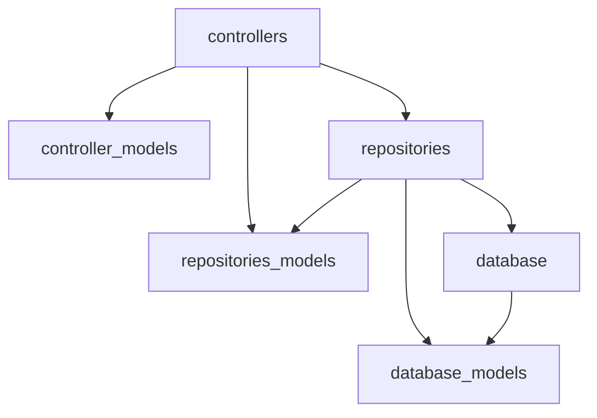

Basic MVC architecture of a REST API using this framework

## Controller (Web) Layer

### Controller

This is the entrypoint into the API from a web request. There should be a controller per resource (section), using a Flask Blueprint.

Each method is associated with an endpoint, and the logic inside each method should ultimately call a repository method to perform data-based operations.

### Controller Models

Controllers should use controller models, which extend Flask's `request` object. These models represent the raw data coming in on an HTTP request, and should handle payload validation via Pydantic.

## Repository Layer

### Repository

Repositories are responsible for bridging the controller layer and the database layer. They should contain methods that perform CRUD operations on the data, and they should be reusable across different controllers.

### Repository Models

These are the core models that should be used for most operations. They should be Pydantic models that represent the data structure used in the repository methods. They can have additional/derived methods and properties that extend the underlying database models, and will likely have more properties than the controller models.

## Database Layer

### Database

The database layer is responsible for the actual data storage and retrieval. It should use SQLAlchemy or another ORM to interact with the database. Any calculations should be handled in the repository layer, not in the database layer.

### Database Models

These are the SQLAlchemy models that represent the database schema. They should be used by the repository layer to perform CRUD operations on the database. These should be one-to-one representations of the database tables, and should not contain any business logic or additional methods beyond what is necessary for data representation.

## Model Example

Abstracting the data flow between the layers allows for separation of concerns by limiting what each layer knows about. For example, the database record may contain values that will never be returned to the end-user in the API response, such as internal IDs and metadata; meanwhile, the API response may return some values that the database record does not contain, such as derived values or calculated fields.

### Retrieve a User (Database -> Repository -> Controller)

Database model (what is stored in the database): internal_id, public_id, created_at, updated_at, first_name, last_name, birthday, email

Repository model (what is used to perform calculations): internal_id, public_id, created_at, updated_at, first_name, last_name, (derived) full_name, birthday, (derived) age, email

Controller model (what is ultimately returned in the API request): public_id, full_name, age, email

### Create a User (Controller -> Repository -> Database)

Controller model (what is received in the API request): first_name, last_name, full_address, email

Repository model (what is used to perform calculations): first_name, last_name, (calculated) validated_full_address, (calculated) validated_email

Database model (what is stored in the database): internal_id, public_id, created_at, updated_at, first_name, last_name, address, email

